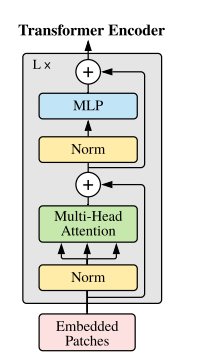
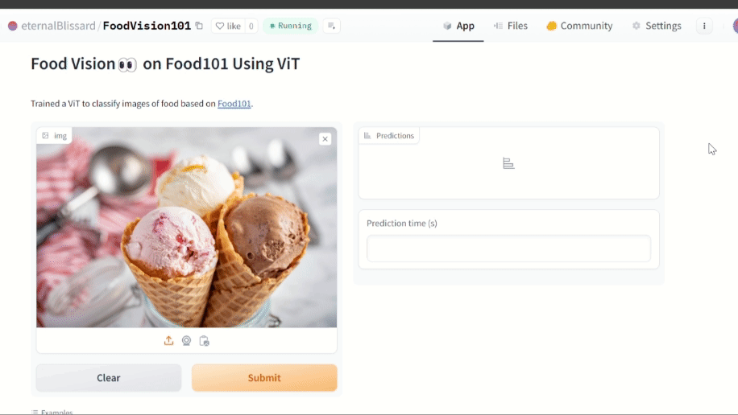

# Food101-ViT
</img>
<a href='https://research.google/blog/transformers-for-image-recognition-at-scale/'>  Src: Google Blog</a>
 
  The main Transformer encoder from <a href="https://arxiv.org/abs/2010.11929">An Image is Worth 16x16 Words: Transformers for Image Recognition at Scale</a></img>
 
</img> 
<a href='https://huggingface.co/spaces/eternalBlissard/FoodVision101'> My Model on Hugging Face</a>
 
## Inspiration
As a person born in India, I was raised as a vegetarian, just like approx 300million other Indians [demograph results](https://en.wikipedia.org/wiki/Vegetarianism_by_country). However, when I went abroad(Hong Kong) with my family for leisure, we felt uneasy since we didn't speak their tongue and couldn't correctly figure out what was right to buy for our consumption at convenience stores or restaurants. So, on our next foreign trip, we packed our bags with vegetarian food, so we didn't need to buy most of our food for consumption. But stuffing duffel bags of food, risking it with customs for no reason, and carrying it around like asses isn't a solution.  
 After about seven years, I am armed with the knowledge of machine learning, deep learning, computer vision, and transformers. I set out to train my model so that it could be helpful to me anywhere on the go and to others with the same issue.
## What it does
The current model is a vision Transformer that takes in image input and classifies it into one of the classes of the Food-101 dataset[link](https://pytorch.org/vision/main/generated/torchvision.datasets.Food101.html).
## How we built it
The base architecture of the model is inspired by "An Image is Worth 16x16 Words: Transformers for Image Recognition at Scale.
"[link](https://arxiv.org/abs/2010.11929) by Alexey et al. I enjoyed reading through the paper, and some concepts/ideas that seemed abstract initially became logical as I brought them to life. It also broadened my concept of Attention. To play with real-world data, I deployed it to hugging face with gradio as a front-end API.
## Challenges we ran into
Finding the right dataset -> Since there were no catered datasets to train my model, I decided to train it on the Food-101 to get a broad sense of food images.
 
The model test accuracy persistently refused to increase from 45%, so I used data augmentation to tackle it, increasing the accuracy to about 60%.
 
Limited compute resources
## Accomplishments that we're proud of
Be able to have a test accuracy of about 60% on Kaggle's compute 
 
The model is efficient and optimized to return the predicted result in a matter of milliseconds(100-150 approx)
 
Model files are not so huge, so can run on a local environment

## What we learned
I gained immense knowledge of Vision Transformers
 
Broadened my understanding of Attention
 
Making Test Functions and code modularity
## What's Next for Handing Food to Transformers
To collect a proper database to train it for vegetarian non-vegetarian vegan classification and extend it to multi-modal methods if possible while keeping the size and efficiency intact
 
Extending it to help people with allergies 
I have done the training for my ViT on Food101 Dataset and deployed model can be used from <a href='https://huggingface.co/spaces/eternalBlissard/FoodVision101'> here</a> .
